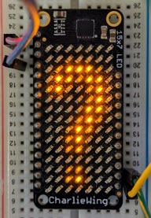

Provides lightness correction tables for eyeball pleasing LED brightness.



Want a smooth fade on your pulsing LEDs or get lovely antialiasing on LED
matrix fonts?  You need to correct your raw linear brightness values for
human eyeball persistence of vision perception sensitivity.

Otherwise known as the [CIE 1931 Lightness curve](https://www.photonstophotos.net/GeneralTopics/Exposure/Psychometric_Lightness_and_Gamma.htm).
It is also [covered in many books](https://www.google.com/search?q=903.3+116+formula&tbm=bks).
The research was done in the 1920s, winding up as one part of the International
Commission on Illumination (CIE) 1931 standard.

Use it to smoothly fade an LED:  
_This example assumes [CircuitPython](https://circuitpython.org/) or
[adafruit-blinka](https://pypi.org/project/Adafruit-Blinka/)._

```python
import time, board, pulseio, pwm_lightness
PWM = pwm_lightness.get_pwm_table(0xffff, max_input=100)
output_pin = pulseio.PWMOut(board.D13)  # or analogio.AnalogOut(A0) & .value
while True:
    for v in range(100, -1, -1):
        output_pin.duty_cycle = PWM[v]
        time.sleep(0.02)
    for v in range(1, 100):
        output_pin.duty_cycle = PWM[v]
        time.sleep(0.02)
```

It is also useful for the RGB values you send to programmable LED strips. Those
are also linear fraction of on-time PWM.

Use it with [Pillow](https://pypi.org/project/Pillow/) to make an
antialiased font shine rather than look like a bold blur:  
_This example assumes a RPi connected to an [I2C Adafruit charlieplexed
LED matrix](https://www.adafruit.com/?q=IS31FL3731)._

```python
import pwm_lightness
PWM = pwm_lightness.get_pwm_table(60)  # 0..255 is our max LED PWM value.
import board, busio, adafruit_is31fl3731, PIL
i2c = busio.I2C(board.SCL, board.SDA)
led_matrix = adafruit_is31fl3731.CharlieBonnet(i2c)
font = PIL.ImageFont.truetype('fonts/RobotoCondensed-Regular.ttf', 16)
image = PIL.Image.new('L', (led_matrix.height, led_matrix.width), 0)
draw = PIL.ImageDraw.Draw(image)
# fill=255 gives us the most antialiasing detail to work with, we control
# overall brightness via the max range in our PWM table.
draw.text((0,-1), '?', fill=255, font=font)
image = image.point(PWM)  # Corrects linear 0..255 values for PWM lightness.
image = image.transpose(PIL.Image.ROTATE_90)  # Match the matrix orientation
led_matrix.image(image)  # Send pixels to our LED display.
```

This code also works on CircuitPython or MicroPython microcontrollers so long
as your build has floating point enabled.  Though for those environments
recomputing a table on device is often overkill.  Precompute the table(s) you
need offline and store them as data to save precious RAM, no on device floating
point required.
